# MARS-NewsLetter — Enterprise Architecture & Developer Reference

> **Document Type:** Reverse-engineered enterprise reference documentation  
> **Generated:** 2026-07-29  
> **Audience:** Architects · Senior Developers · Support · Operations  
> **License:** MIT

---

## Table of Contents

1. [Executive Summary](#1-executive-summary)
2. [System Overview](#2-system-overview)
3. [Repository Structure](#3-repository-structure)
4. [Architecture](#4-architecture)
5. [Module Documentation](#5-module-documentation)
6. [API Documentation](#6-api-documentation)
7. [Database Documentation](#7-database-documentation)
8. [Authentication & Authorization](#8-authentication--authorization)
9. [Infrastructure](#9-infrastructure)
10. [Configuration](#10-configuration)
11. [Application Flow](#11-application-flow)
12. [Error Handling](#12-error-handling)
13. [Performance & Scalability](#13-performance--scalability)
14. [Security Review](#14-security-review)
15. [Developer Guide](#15-developer-guide)
16. [Deployment Guide](#16-deployment-guide)
17. [Operational Runbook](#17-operational-runbook)
18. [Known Risks & Technical Debt](#18-known-risks--technical-debt)

---

## 1. Executive Summary

### What the Application Does

**MARS-NewsLetter** is a production-grade, multi-agent AI application that autonomously produces publication-quality industry newsletters from live web intelligence. Given a set of industries and a date range, it discovers relevant companies and sources, curates and ranks the material, drafts a structured long-form newsletter, and runs a quality-review pipeline before delivering a polished Markdown document and a print-ready PDF.

### Business Purpose

Organizations that need periodic, research-backed intelligence reports — market digests, competitive briefings, technology landscape newsletters — today spend significant analyst hours gathering, curating, and authoring content. MARS-NewsLetter collapses that cycle from days to under an hour by automating every stage from source discovery through editorial review. The output is citation-backed, quality-scored, and repeatable across any industry taxonomy.

### Key Capabilities

| Capability | Details |
|------------|---------|
| **Multi-industry coverage** | Supports any combination from a curated taxonomy of industries and sub-domains |
| **Autonomous source discovery** | Discovers top companies in each industry, runs per-company and industry-wide web searches (DDGS), accepts user-supplied URLs, or combines both |
| **AI curation** | Researcher agent ranks, deduplicates, authority-tags, and HEAD-verifies every source URL |
| **Structured generation** | Section-by-section writer prevents token-limit hits; produces a 60–90 KB, 22-section newsletter |
| **Quality review pipeline** | LangGraph graph performs URL verification, LLM critique, claim validation, and multi-dimensional scoring |
| **PDF output** | Print-ready, bookmarked PDF with TOC, cover page, and source footnotes |
| **Enterprise LLM gateway** | Full OAuth2/OIDC enterprise gateway integration with token caching and TLS |
| **Multi-provider LLM** | OpenAI · Anthropic · Azure OpenAI · AWS Bedrock · Google Gemini · Mistral |
| **Real-time streaming** | WebSocket + REST console polling for live stage progress |
| **Extensible tooling** | Custom search APIs and internal knowledge bases pluggable via decorator registration |

---

## 2. System Overview

### Application Architecture

MARS-NewsLetter follows a **two-tier, API-driven pipeline architecture**:

- **Tier 1 — Frontend:** Next.js 14 TypeScript SPA acting as a wizard UI that drives the pipeline and displays results.
- **Tier 2 — Backend:** Python 3.12 FastAPI service orchestrating a 5-stage AI pipeline through the `mars_cmbagent` multi-agent framework.

There is no message broker, no microservice split, and no separate worker process. All pipeline stages run as `asyncio` background tasks inside the FastAPI process, communicating state through a SQLite database and on-disk artifact files.

### Major Modules

| Module | Role |
|--------|------|
| `core/` | FastAPI application factory, settings, structured logging, cmbagent monkey-patch |
| `routers/` | HTTP route handlers for the newsletter pipeline, providers, taxonomy, files, and health |
| `models/` | Pydantic schemas for all request/response contracts |
| `services/` | ConfigBridge, CredentialVault, SessionManager, TaxonomyService, ProviderBridge |
| `task_framework/newsletter/` | All 5-stage pipeline logic: helpers, source collection, curation, generation, review |
| `execution/` | Thread-safe console ring buffer, LLM cost tracking |
| `websocket/` | WebSocket event serialization |
| `data/` | Static industry taxonomy JSON |
| `frontend/` | Next.js 14 application: wizard, stage viewer, quality dashboard |

### Service Boundaries

```
Browser ←──HTTP/WS──→ FastAPI (port 8000) ←──in-process──→ mars_cmbagent
                              │                                    │
                              │                             litellm (LLM calls)
                              │                                    │
                              ↓                            ┌───────┴──────────┐
                         SQLite DB                         │  LLM Providers   │
                         (cmbagent ORM)                    │  OpenAI / Azure  │
                              │                            │  Anthropic/Claude│
                              ↓                            │  AWS Bedrock     │
                     On-disk artifacts                     │  Gemini / Mistral│
                     (Markdown/JSON/PDF)                   │  Enterprise GW   │
                                                           └──────────────────┘
```

---

## 3. Repository Structure

```
MARS_NewsLetter/
├── README.md                        # Quick-start + pipeline overview
├── CLAUDE.md                        # Engineering principles (Staff+ standards)
├── REFACTOR_PLAN.md                 # Known issues + phased refactor roadmap
├── ENTERPRISE_DOCUMENTATION.md      # This file
│
├── docs/
│   ├── ENTERPRISE_SETUP.md          # Enterprise gateway configuration reference
│   └── CUSTOM_TOOLS.md              # Custom tool registration guide
│
├── backend/                         # Python 3.12 FastAPI service
│   ├── run.py                       # Entry point — loads .env, starts uvicorn
│   ├── main.py                      # FastAPI app + WebSocket handler
│   ├── requirements.txt             # Pinned Python dependencies
│   ├── .env.example                 # Annotated environment template
│   ├── .env                         # Runtime secrets (NOT committed)
│   │
│   ├── core/
│   │   ├── app.py                   # FastAPI factory + lifespan hooks
│   │   ├── config.py                # Settings dataclass (env var mapping)
│   │   ├── logging.py               # structlog setup + JSON output
│   │   └── cmbagent_patch.py        # Raises cmbagent 25 KB per-message cap
│   │
│   ├── models/
│   │   ├── newsletter_schemas.py    # All Pydantic request/response models
│   │   └── provider_schemas.py      # LLM provider credential schemas
│   │
│   ├── routers/
│   │   ├── newsletter.py            # Main pipeline endpoints
│   │   ├── providers.py             # Provider introspection + credential update
│   │   ├── taxonomy.py              # Industry taxonomy endpoint
│   │   ├── models.py                # Available LLM model listing
│   │   ├── files.py                 # Stage artifact file download
│   │   └── health.py                # Health check endpoint
│   │
│   ├── services/
│   │   ├── config_bridge.py         # Vault + .env → cmbagent ProviderRegistry sync
│   │   ├── credential_vault.py      # Encrypted on-disk credential store
│   │   ├── provider_bridge.py       # Lightweight .env → ProviderRegistry sync
│   │   ├── session_manager.py       # Stage-1 setup.json persistence
│   │   └── taxonomy_service.py      # Taxonomy validation against industry_taxonomy.json
│   │
│   ├── task_framework/
│   │   └── newsletter/
│   │       ├── helpers.py           # run_stage_1 … run_stage_5 orchestration
│   │       ├── constants.py         # CANONICAL_HEADINGS (22 section names)
│   │       ├── mode_dispatcher.py   # cmbagent one_shot / planning_and_control router
│   │       ├── source_collector.py  # Stage 2: DDGS + user-URL collection
│   │       ├── link_validator.py    # HTTP HEAD URL health checking
│   │       ├── url_health.py        # Extended URL analysis + domain extraction
│   │       ├── antirefusal.py       # LLM refusal detection + rescue
│   │       ├── domain_classifier.py # Authority tier assignment per domain
│   │       ├── curated_quality_filter.py # Date + relevance filtering
│   │       ├── pdf_generator.py     # reportlab/WeasyPrint PDF rendering
│   │       ├── prompts/
│   │       │   └── stages.py        # All prompt templates (discovery, curation, generation)
│   │       ├── stage4/
│   │       │   ├── runner.py        # Per-section writer + link whitelist enforcement
│   │       │   └── sections.py      # Section-specific prompts + word budgets
│   │       └── stage5/
│   │           ├── graph.py         # LangGraph state machine definition
│   │           ├── nodes.py         # Node implementations (parse, validate, score, PDF)
│   │           └── llm_client.py    # LLM calls for quality scoring
│   │
│   ├── execution/
│   │   ├── console_capture.py       # Thread-safe ring buffer for stage console logs
│   │   └── cost_collector.py        # Per-stage LLM token + USD cost tracking
│   │
│   ├── websocket/
│   │   └── events.py                # WebSocket JSON event serialization helpers
│   │
│   ├── data/
│   │   ├── industry_taxonomy.json   # Static industry/sub-domain definitions
│   │   └── raw_ddgs_results_step_1.json  # Sample DDGS data (testing)
│   │
│   └── tests/
│       ├── e2e_smoke.py             # End-to-end smoke tests
│       ├── test_newsletter_pipeline.py   # Unit tests for pipeline stages
│       └── enterprise_sim/
│           └── server.py            # Mock enterprise gateway for integration tests
│
└── frontend/                        # Next.js 14 TypeScript SPA
    ├── app/
    │   ├── layout.tsx               # Root layout + MARS branding
    │   ├── page.tsx                 # Home page (session sidebar + wizard)
    │   ├── providers.tsx            # Client-side context providers
    │   └── globals.css              # Tailwind base + MARS design tokens
    ├── components/
    │   ├── core/                    # Button, Card, Input, Modal, StatusBadge, Stepper
    │   ├── layout/                  # MarsLogo, TopBar
    │   ├── newsletter/              # NewsletterApp, SetupPanel, ExecutionPanel, ReportView
    │   ├── settings/                # Provider credential management UI
    │   └── sessions/                # Recent task sidebar
    ├── hooks/
    │   ├── useNewsletterTask.ts     # Task state + API calls
    │   ├── useModelConfig.ts        # Per-stage model override state
    │   ├── useProviders.ts          # Provider credential management
    │   └── useTaxonomy.ts           # Industry taxonomy + picker logic
    ├── lib/                         # config.ts, dateUtils.ts, fetchWithRetry.ts
    ├── types/                       # TypeScript interfaces mirroring backend schemas
    ├── contexts/                    # ThemeContext (MARS color system)
    ├── package.json                 # Node.js dependencies
    └── .env.local.example           # Frontend environment template
```

---

## 4. Architecture

### Architecture Pattern

**MARS-NewsLetter is a Layered Monolith with an embedded Multi-Agent Pipeline.**

It is not a microservice — all processing runs in a single Python process. The deliberate design decision is:

1. **Layered** — Router → Service → Task Framework → cmbagent reflects clear separation of concerns.
2. **Monolith** — Single deployable unit with shared in-memory state for task tracking and console ring buffers.
3. **Pipeline-oriented** — Business logic is expressed as a 5-stage sequential pipeline, not as event-driven or reactive components.
4. **Agent-embedded** — `mars_cmbagent` (AG2-based multi-agent framework) is an embedded library, not a separate service. LangGraph is similarly embedded for Stage 5.

This choice is justified because:
- Pipeline stages are long-running (minutes each), making inter-service messaging overhead irrelevant.
- State sharing (ring buffers, running task handles) is simpler in-process.
- Operational complexity is minimal — a single Docker image and a single port.

### Component Diagram

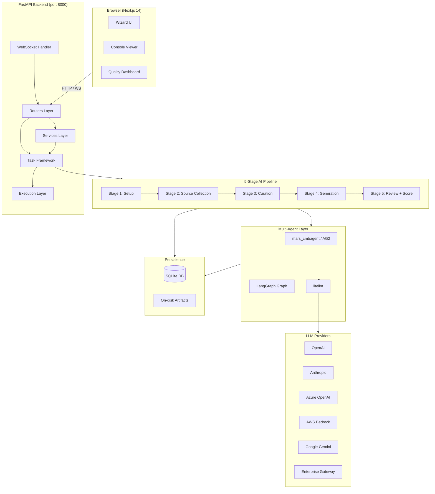

### Sequence: Stage Execution

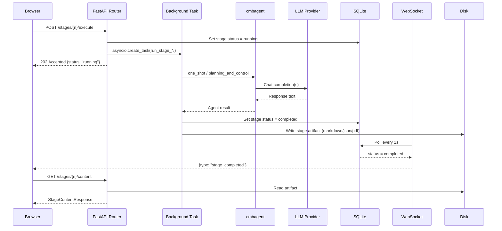

### Data Flow Overview

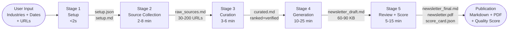

---

## 5. Module Documentation

### 5.1 `core/` — Application Foundation

#### Purpose
Application factory, settings, structured logging, and cmbagent compatibility patch.

#### Responsibilities
- Build the FastAPI application with CORS, lifespan hooks, and middleware.
- Load environment configuration into a typed `Settings` dataclass.
- Configure structlog for structured JSON or human-readable output.
- Raise cmbagent's 25 KB per-message content cap before any agent is instantiated.

#### Key Classes & Functions

| Name | File | Description |
|------|------|-------------|
| `create_app()` | `app.py` | FastAPI factory. Registers CORS, lifespan, middleware. |
| `Settings` | `config.py` | Dataclass mapping env vars to typed fields. Resolves relative work-dir paths against `backend/`. |
| `get_logger(name)` | `logging.py` | Returns a bound structlog logger with module context. |
| `apply_cmbagent_message_limit_patch()` | `cmbagent_patch.py` | Monkey-patches cmbagent's `MAX_MSG_CONTENT_CHARS` constant before agents are created. |

#### Data Flow
`.env` file → `python-dotenv` → `os.environ` → `Settings` dataclass → `core/app.py` lifespan → `ConfigBridge.sync_all()`

---

### 5.2 `routers/newsletter.py` — Pipeline API

#### Purpose
The primary HTTP API for the newsletter pipeline: create tasks, execute stages, retrieve content, manage gates, and stream console logs.

#### Responsibilities
- Accept `POST /api/newsletter/create`, validate taxonomy, persist setup, complete Stage 1.
- Accept `POST /stages/{n}/execute`, launch asyncio background task, return immediately.
- Accept `GET /stages/{n}/content`, read stage artifact from disk, return with link validation metadata.
- Accept `GET /stages/{n}/console`, return ring-buffer lines since a given index.
- Accept `PUT /stages/{n}/content`, persist user edits and mark downstream stages pending.
- Accept `POST /gate/links` (Gate A) and `POST /gate/template` (Gate B).
- Maintain `_running: dict[str, asyncio.Task]` and `_running_lock` for background task tracking.

#### Dependencies
- `task_framework/newsletter/helpers.py` — stage runner functions
- `services/session_manager.py` — setup.json I/O
- `services/taxonomy_service.py` — industry validation
- `execution/console_capture.py` — ring buffer
- `cmbagent` ORM — `WorkflowRun`, `TaskStage` models

#### Key Internal State
```python
_running: Dict[str, asyncio.Task]     # "{task_id}:{stage_num}" → asyncio.Task
_running_lock: asyncio.Lock           # protects _running dict
```

---

### 5.3 `services/config_bridge.py` — Credential Synchronization

#### Purpose
Synchronize LLM credentials from the encrypted vault and `.env` into cmbagent's `ProviderRegistry`, so all downstream LLM calls use the correct credentials without needing manual cmbagent configuration.

#### Responsibilities
- On server startup: read vault + `.env`, push to `ProviderRegistry`.
- After credential update via UI: re-sync all providers.
- Priority: CredentialVault wins over `.env`.

#### Data Flow
```
CredentialVault (encrypted)  ──┐
                                ├──→ ConfigBridge.sync_all() ──→ ProviderRegistry ──→ litellm
.env (OPENAI_API_KEY, etc.)  ──┘
```

---

### 5.4 `services/credential_vault.py` — Encrypted Credential Store

#### Purpose
Persist API keys and provider credentials supplied through the UI across server restarts, without storing them in plaintext on disk.

#### Responsibilities
- Store encrypted credentials per provider ID.
- Load on startup, update on UI credential submission.
- Expose to `ConfigBridge` for sync.

---

### 5.5 `services/taxonomy_service.py` — Industry Taxonomy

#### Purpose
Validate user industry/sub-domain selections against the static taxonomy before any AI stage runs.

#### Key Method
```python
validate_selection(industries: List[IndustrySelection]) -> None
# Raises ValueError if any industry or sub-domain is not in taxonomy
```

#### Data Source
`backend/data/industry_taxonomy.json` — loaded once at startup.

---

### 5.6 `task_framework/newsletter/helpers.py` — Stage Runners

#### Purpose
The central orchestration layer. Each `run_stage_N()` function implements one pipeline stage end-to-end.

#### Key Functions

| Function | Stage | Type | Duration |
|----------|-------|------|----------|
| `run_stage_1(setup, work_dir)` | Setup | Deterministic | < 2 s |
| `run_stage_2(setup, work_dir)` | Source Collection | AI (cmbagent) | 2–8 min |
| `run_stage_3(setup, work_dir)` | Curation | AI (cmbagent) | 3–6 min |
| `run_stage_4(setup, work_dir)` | Generation | AI (cmbagent + direct LLM) | 10–25 min |
| `run_stage_5(setup, work_dir)` | Review/Score | LangGraph + LLM | 5–15 min |

#### Dependencies
- `source_collector.py`, `link_validator.py`, `mode_dispatcher.py`
- `stage4/runner.py`, `stage5/graph.py`
- `cmbagent` (one_shot / planning_and_control / deep_research)

---

### 5.7 `task_framework/newsletter/source_collector.py` — Source Collection

#### Purpose
Implement Stage 2: discover top companies, run DDGS queries, collect user URLs, validate links.

#### Responsibilities
- **Company discovery** (optional): cmbagent researcher finds top-N companies per industry.
- **Per-company news**: targeted DDGS queries against each company's domain.
- **Industry-wide search**: broad DDGS queries for trends not tied to specific companies.
- **User-URL enrichment**: validate and summarize user-supplied links.
- **URL validation**: HTTP HEAD check every discovered URL.

#### Source Modes
```
user_links_only → validate user URLs only, skip DDGS
ddgs_only       → run all DDGS substeps, ignore user_urls
combined        → run all DDGS substeps + enrich user_urls
```

---

### 5.8 `task_framework/newsletter/link_validator.py` — URL Health Checker

#### Purpose
HTTP HEAD-check all discovered and curated URLs to classify them by reachability before the newsletter writer sees them.

#### Authority Tiers
| Tier | Meaning |
|------|---------|
| `official` | Verified company-owned domain |
| `authority` | Recognized industry authority |
| `neutral` | News site, analyst blog |
| `unknown` | Unclassified / sketchy |

#### Reachability States
| State | HTTP Codes | Treatment |
|-------|-----------|-----------|
| `ok` | 2xx | Keep in pipeline |
| `blocked` | 403, 429 | Keep — CDN anti-bot |
| `dead` | 4xx (not 403/429) | Drop before Stage 4 |
| `error` | 5xx | Drop before Stage 4 |

---

### 5.9 `task_framework/newsletter/stage4/runner.py` — Section Writer

#### Purpose
Implement Stage 4 section-by-section generation with link whitelist enforcement.

#### Key Algorithm
```
1. Extract allowed URL set from curated.md (once)
2. For each section in template:
   a. Build section-specific prompt (title, guidance, word budget, sources)
   b. Call LLM directly via acomplete()
   c. Scan output for [text](url) patterns
   d. For any URL NOT in allowed set: strip hyperlink, keep visible text
   e. Log stripped URLs for audit
3. Prepend metadata header
4. Join all sections → newsletter_draft.md
5. Write report_structure.json
```

#### Why Section-by-Section
The full 22-section newsletter is 60–90 KB. A single LLM call would exhaust output-token limits on all major models. Per-section calls stay well within limits and allow targeted prompting per section type.

---

### 5.10 `task_framework/newsletter/stage5/graph.py` — LangGraph Review Pipeline

#### Purpose
Implement Stage 5 as a deterministic LangGraph state machine that orchestrates URL verification, LLM critique, PDF rendering, and quality scoring.

#### Graph Nodes

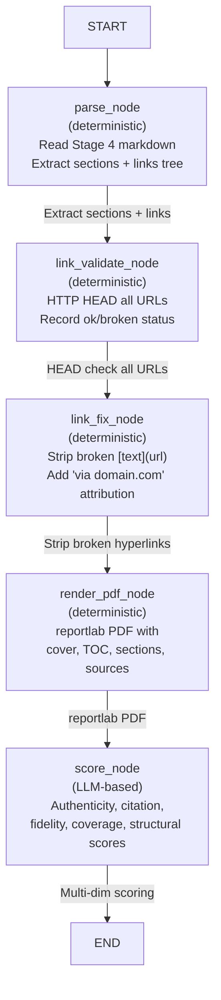

#### Score Card Schema
```json
{
  "authenticity_score": 75,
  "citation_score": 82,
  "factual_fidelity_score": 78,
  "coverage_score": 88,
  "structural_completeness_score": 95,
  "overall_score": 83,
  "verdict": "production-ready",
  "suggestions": ["..."]
}
```

---

### 5.11 `execution/console_capture.py` — Console Ring Buffer

#### Purpose
Capture and replay stage console output (AI agent messages, tool calls, log lines) for the REST polling endpoint, without holding them all in memory indefinitely.

#### Design
- Thread-safe `dict[str, list[str]]` keyed by `"{task_id}:{stage_num}"`.
- `append(key, line)` — push new line.
- `get_lines(key, since_index)` — return lines from index, return `next_index`.
- Ring buffer semantics: old lines evicted when buffer exceeds max size.

---

### 5.12 Frontend — Next.js 14 SPA

#### Purpose
Multi-step wizard UI that guides the user through newsletter creation, displays live stage progress, previews stage outputs, and shows the quality dashboard.

#### Key Components

| Component | File | Purpose |
|-----------|------|---------|
| `NewsletterApp` | `components/newsletter/NewsletterApp.tsx` | Root wizard shell, task state, step navigation |
| `SetupPanel` | `components/newsletter/SetupPanel.tsx` | Stage 1 form: industries, dates, source mode, audience |
| `IndustryPicker` | `components/newsletter/IndustryPicker.tsx` | Taxonomy multi-select with sub-domain drill-down |
| `ExecutionPanel` | `components/newsletter/ExecutionPanel.tsx` | Stages 2–5 execution controls, progress indicators |
| `ConsoleOutput` | `components/newsletter/ConsoleOutput.tsx` | Auto-scrolling real-time log view (REST polling) |
| `ReportView` | `components/newsletter/ReportView.tsx` | Quality dashboard: Report / Quality / URLs / PDF tabs |
| `GateLinks` | `components/newsletter/GateLinks.tsx` | Gate A: link prioritization (pin, boost, exclude) |
| `GateTemplate` | `components/newsletter/GateTemplate.tsx` | Gate B: section template builder |
| `ProviderSettings` | `components/settings/ProviderSettings.tsx` | LLM provider credential management |
| `SessionSidebar` | `components/sessions/SessionSidebar.tsx` | Recent task list with status indicators |

#### State Management
No Redux or Zustand. State is managed via custom React hooks backed by server-authoritative data:
- `useNewsletterTask` — task data, fetch, execute, poll
- `useModelConfig` — per-stage model overrides
- `useProviders` — credential management
- `useTaxonomy` — taxonomy loading and picker logic

---

## 6. API Documentation

All backend endpoints are prefixed with `/api/`. Interactive docs are available at `http://localhost:8000/docs`.

### Authentication
No per-request user authentication. The API is designed for single-tenant or internal deployment behind a corporate reverse proxy that handles identity. All LLM credentials are server-side (in `.env` or the credential vault).

---

### 6.1 `POST /api/newsletter/create`

Create a new newsletter task. Stage 1 completes synchronously before the response is returned.

**Request Body: `NewsletterCreateRequest`**

```json
{
  "title": "GenAI Weekly — July 2026",
  "industries": [
    {
      "industry": "Artificial Intelligence",
      "sub_domains": ["Large Language Models", "Agentic AI"]
    }
  ],
  "date_from": "2026-07-22",
  "date_to": "2026-07-29",
  "source_mode": "combined",
  "user_urls": ["https://openai.com/blog/gpt-5"],
  "audience": "AI product managers",
  "focus_prompt": "Focus on agent frameworks and tool use",
  "tone": "analytical",
  "pinned_urls": [],
  "mode_config": {
    "stage_2_top_companies_count": 12,
    "stage_2_min_sources": 30
  }
}
```

**Field Reference**

| Field | Type | Required | Description |
|-------|------|----------|-------------|
| `title` | string | No | Human-readable run name |
| `industries` | `IndustrySelection[]` | Yes | At least one industry + sub-domain |
| `date_from` | ISO date | Yes | Start of coverage window |
| `date_to` | ISO date | No | Always coerced to today server-side |
| `source_mode` | enum | No | `combined` \| `ddgs_only` \| `user_links_only` |
| `user_urls` | string[] | No | Must be http/https URLs |
| `analyze_user_links` | bool | No | Auto-pin + dedicate analysis to user links |
| `audience` | string | No | Free-text audience hint |
| `focus_prompt` | string | No | What the user cares about |
| `tone` | string | No | Editorial tone hint |
| `pinned_urls` | string[] | No | URLs that survive all filtering stages |
| `mode_config` | `StageModeConfig` | No | Per-stage AI strategy overrides |

**Response: `NewsletterCreateResponse` (200 OK)**

```json
{
  "task_id": "0f6ae8324aaf4833a6a8b75d3d017d73",
  "work_dir": "/app/cmbdir_newsletter/sessions/newsletter/tasks/0f6ae8...",
  "stages": [
    { "stage_number": 1, "stage_name": "setup", "status": "completed" },
    { "stage_number": 2, "stage_name": "source_collection", "status": "pending" },
    { "stage_number": 3, "stage_name": "curation", "status": "pending" },
    { "stage_number": 4, "stage_name": "generation", "status": "pending" },
    { "stage_number": 5, "stage_name": "review", "status": "pending" }
  ]
}
```

**Errors**

| Code | Condition |
|------|-----------|
| 400 | Missing industries, invalid date format, date_from in future |
| 400 | URL doesn't start with http:// or https:// |
| 400 | Industry/sub-domain not found in taxonomy |
| 422 | Pydantic validation failure |

---

### 6.2 `GET /api/newsletter/{task_id}`

Retrieve full task state including all stage statuses, progress, cost, and setup payload.

**Response: `NewsletterTaskStateResponse` (200 OK)**

```json
{
  "task_id": "0f6ae8324aaf4833a6a8b75d3d017d73",
  "title": "GenAI Weekly",
  "status": "running",
  "work_dir": "/app/cmbdir_newsletter/...",
  "created_at": "2026-07-29T10:30:00Z",
  "stages": [...],
  "current_stage": 2,
  "progress_percent": 20.0,
  "setup": { ...original request payload... },
  "total_cost_usd": 1.23
}
```

**Errors:** 404 if task_id not found.

---

### 6.3 `POST /api/newsletter/{task_id}/stages/{stage_num}/execute`

Start a pipeline stage as a background task. Returns immediately with `status: "running"`.

**Path Parameters**
- `task_id` — UUID hex string from create response
- `stage_num` — integer 2–5 (Stage 1 auto-completes on create)

**Request Body: `NewsletterExecuteRequest` (optional)**

```json
{
  "mode_override": "planning_and_control",
  "config_overrides": {
    "model": "gpt-4o",
    "researcher_model": "gpt-4-turbo"
  }
}
```

**Response: `NewsletterStageResponse` (202 Accepted)**

```json
{
  "stage_number": 2,
  "stage_name": "source_collection",
  "status": "running",
  "started_at": "2026-07-29T10:31:00Z"
}
```

**Errors**

| Code | Condition |
|------|-----------|
| 400 | Prior stage not completed |
| 400 | Invalid stage number |
| 404 | task_id not found |
| 409 | Stage already running |

---

### 6.4 `GET /api/newsletter/{task_id}/stages/{stage_num}/content`

Retrieve the primary artifact and metadata for a completed stage.

**Response: `StageContentResponse` (200 OK)**

```json
{
  "stage_number": 3,
  "stage_name": "curation",
  "status": "completed",
  "content": "# Stage 3 — Curated Sources\n\n...(full markdown)...",
  "shared_state": { "curated": "..." },
  "output_files": ["/work_dir/stage_3/curated.md"],
  "link_validation": [
    {
      "url": "https://openai.com/blog/gpt-5",
      "reachable": true,
      "status_code": 200,
      "final_url": "https://openai.com/blog/gpt-5",
      "domain": "openai.com",
      "is_authentic": true,
      "authority_tier": "official",
      "notes": null
    }
  ]
}
```

---

### 6.5 `GET /api/newsletter/{task_id}/stages/{stage_num}/console`

Poll stage console logs (AI agent messages, tool outputs, progress lines).

**Query Parameters**
- `since` (int, default 0) — return lines from this index

**Response (200 OK)**

```json
{
  "lines": ["Starting Stage 2...", "> CALLING RESEARCHER", "..."],
  "next_index": 42,
  "is_done": false
}
```

**Usage Pattern (polling loop)**
```javascript
let since = 0;
while (!isDone) {
  const res = await fetch(`/api/newsletter/${taskId}/stages/2/console?since=${since}`);
  const { lines, next_index, is_done } = await res.json();
  appendToConsole(lines);
  since = next_index;
  isDone = is_done;
  await sleep(500);
}
```

---

### 6.6 `PUT /api/newsletter/{task_id}/stages/{stage_num}/content`

Persist manual user edits to a stage artifact. Marks all downstream stages as `pending`.

**Request Body: `NewsletterContentUpdateRequest`**

```json
{
  "content": "# Edited Newsletter\n\n...",
  "field": "default"
}
```

**Response:** `StageContentResponse` (200 OK) with updated content.

**Side Effect:** Stages `stage_num+1` through 5 are set to `pending` in the database.

---

### 6.7 `GET /api/newsletter/{task_id}/dashboard`

Full Stage 5 quality dashboard payload.

**Response (200 OK)**

```json
{
  "score_card": {
    "authenticity_score": 75,
    "citation_score": 82,
    "factual_fidelity_score": 78,
    "coverage_score": 88,
    "structural_completeness_score": 95,
    "overall_score": 83,
    "verdict": "production-ready",
    "suggestions": ["Add data points in 'Data & Evidence'"]
  },
  "link_validation_results": [...],
  "critic_report": { ...node-by-node feedback... },
  "node_timings": {
    "parse_node": 0.5,
    "link_validate_node": 5.2,
    "render_pdf_node": 8.3,
    "score_node": 45.2
  }
}
```

---

### 6.8 `POST /api/newsletter/{task_id}/gate/links` (Gate A)

Apply link prioritization decisions before Stage 3 curation runs.

**Request Body: `LinkPrioritiesRequest`**

```json
{
  "priorities": [
    { "url": "https://important.com/report", "action": "pin", "weight": 0.95 },
    { "url": "https://irrelevant.com/ad", "action": "exclude" }
  ],
  "add_urls": ["https://extra-source.com/analysis"],
  "min_relevance": 0.4
}
```

**Link Actions**

| Action | Meaning |
|--------|---------|
| `pin` | Survives all filtering; cited if relevant |
| `boost` | Higher relevance weight during curation |
| `normal` | Default treatment |
| `exclude` | Dropped before Stage 3 |

**Side Effect:** Marks Stage 3+ as `pending` for re-curation.

---

### 6.9 `POST /api/newsletter/{task_id}/gate/template` (Gate B)

Replace the canonical 22 sections with a custom section template before Stage 4 generation.

**Request Body: `ReportTemplateRequest`**

```json
{
  "sections": [
    {
      "title": "Key Developments",
      "depth": "standard",
      "points": 5,
      "guidance": "Focus on regulatory changes in EU",
      "word_count": 400
    },
    {
      "title": "Market Trends",
      "depth": "deep",
      "points": 3
    }
  ],
  "tone": "executive briefing",
  "audience": "C-level executives"
}
```

**Section Depths**

| Depth | Word Budget | Method |
|-------|------------|--------|
| `light` | ~180 words | one_shot summary |
| `standard` | ~340 words | one_shot with analysis |
| `deep` | ~650 words | cmbagent deep_research |

**Side Effect:** Marks Stage 4+ as `pending` for re-generation with new template.

---

### 6.10 `POST /api/newsletter/{task_id}/regenerate-pdf`

Re-render the PDF from the existing Stage 5 Markdown without re-running any LLM.

**Response: `CompilePdfResponse` (200 OK)**

```json
{
  "pdf_path": "/work_dir/stage_5/newsletter.pdf",
  "success": true,
  "backend_used": "reportlab",
  "error": null
}
```

---

### 6.11 `POST /api/newsletter/{task_id}/repair-score-card`

Re-parse the score-card LLM output and refresh the score block in the final Markdown.  
Useful for runs executed before the current score card format was introduced.

---

### 6.12 `DELETE /api/newsletter/{task_id}`

Delete all database rows and on-disk work directory for a task.

**Response:** 204 No Content

---

### 6.13 `GET /api/newsletter/recent`

List recent newsletter tasks.

**Query Parameters:** `limit` (int, default 25)

**Response:** `List[NewsletterRecentTaskResponse]`

```json
[
  {
    "task_id": "0f6ae8...",
    "title": "GenAI Weekly",
    "status": "completed",
    "created_at": "2026-07-29T10:30:00Z",
    "current_stage": 5,
    "progress_percent": 100.0
  }
]
```

---

### 6.14 `GET /api/newsletter/taxonomy`

Return the industry taxonomy for the UI picker.

**Response: `TaxonomyResponse` (200 OK)**

```json
{
  "industries": [
    {
      "industry": "Artificial Intelligence",
      "industry_domain": "ai",
      "sub_domains": ["Large Language Models", "Computer Vision", "NLP"]
    }
  ],
  "authentic_domain_hints": {
    "openai.com": ["OpenAI"],
    "anthropic.com": ["Anthropic"]
  },
  "neutral_authority_domains": ["techcrunch.com", "venturebeat.com"],
  "version": "2026-07-29"
}
```

---

### 6.15 `WS /ws/newsletter/{task_id}/{stage_num}`

Real-time WebSocket for stage lifecycle events.

**Events**

```json
{ "type": "status", "message": "Connected to stage 2", "stage_num": 2 }
{ "type": "stage_completed", "stage_num": 2, "stage_name": "source_collection" }
{ "type": "stage_failed", "stage_num": 2, "error": "Execution timeout" }
```

**Watchdog:** If a stage is `running` but the background asyncio task is no longer alive and no new console lines appear for 5 consecutive 1-second ticks, the WebSocket handler marks the stage `failed` with a "no active process" error message.

---

## 7. Database Documentation

### 7.1 Database Engine

**SQLite** — embedded file at `<work_dir>/cmbagent_database.db`.  
Schema is owned and migrated by the `mars_cmbagent` ORM (SQLAlchemy).

### 7.2 Core Tables

#### `sessions`

| Column | Type | Notes |
|--------|------|-------|
| `id` | TEXT PK | String session identifier (always `"newsletter"`) |
| `name` | TEXT | Human-readable label |
| `created_at` | DATETIME | |
| `meta` | JSON | Optional metadata |

#### `workflow_runs`

| Column | Type | Notes |
|--------|------|-------|
| `id` | TEXT PK | UUID hex string — the `task_id` in the API |
| `session_id` | TEXT FK → `sessions.id` | |
| `mode` | TEXT | cmbagent execution mode |
| `agent` | TEXT | Agent type |
| `model` | TEXT | Primary model used |
| `status` | TEXT | `pending` \| `running` \| `completed` \| `failed` |
| `meta` | JSON | Task-level metadata (title, industries, cost, etc.) |
| `started_at` | DATETIME | |
| `completed_at` | DATETIME | |

#### `task_stages`

| Column | Type | Notes |
|--------|------|-------|
| `id` | TEXT PK | UUID |
| `parent_run_id` | TEXT FK → `workflow_runs.id` | |
| `stage_number` | INT | 1–5 |
| `stage_name` | TEXT | `setup` \| `source_collection` \| `curation` \| `generation` \| `review` |
| `status` | TEXT | `pending` \| `running` \| `completed` \| `failed` |
| `started_at` | DATETIME | |
| `completed_at` | DATETIME | |
| `error_message` | TEXT | Populated on failure |
| `output_data` | JSON | Stage-specific output references |
| `meta` | JSON | Cost, model, timing metadata |

### 7.3 ER Diagram

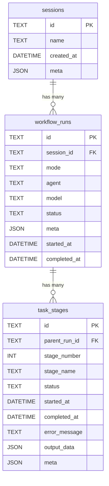

### 7.4 On-Disk Artifact Persistence

Beyond the relational tables, each task writes artifacts to the filesystem:

```
<work_dir>/sessions/newsletter/tasks/{task_id}/
├── setup.json                    # Stage 1: user input + validated taxonomy
├── stage_1/
│   └── setup.md                  # Human-readable setup summary
├── stage_2/
│   ├── raw_sources.md            # 30–200 discovered sources
│   ├── link_validation.json      # URL health check results
│   ├── top_companies.json        # Discovered companies
│   └── console.log               # Stage console output
├── stage_3/
│   ├── curated.md                # Ranked, verified source list
│   ├── url_validation.json       # Stage 3 URL checks
│   ├── quality_filter.json       # Filter decisions
│   └── console.log
├── stage_4/
│   ├── newsletter_draft.md       # Full 60–90 KB newsletter draft
│   ├── report_structure.json     # Parsed sections tree for UI
│   ├── outline.md                # Analyst outline
│   ├── source_coverage.json      # Source citation coverage
│   └── console.log
└── stage_5/
    ├── newsletter_final.md        # Polished final newsletter
    ├── {title}_{date}.pdf         # Print-ready PDF
    ├── score_card.json            # Quality scores
    ├── dashboard.json             # Full quality payload for UI
    ├── evaluation.json            # Detailed LLM critique
    ├── critic_report.json         # Critic report
    ├── url_verification.json      # Stage 5 URL checks
    └── console.log
```

---

## 8. Authentication & Authorization

### Current Implementation

MARS-NewsLetter does **not** implement per-user authentication or authorization. It is designed for:
- Single-operator deployment (one person or team running newsletters)
- Internal deployment behind a corporate reverse proxy that handles identity
- API-first usage where the caller controls access

### LLM Provider Authentication

All LLM credentials are server-side only — never exposed to the browser.

**Supported authentication methods per provider:**

| Provider | Auth Method |
|----------|------------|
| OpenAI | API key (`OPENAI_API_KEY`) |
| Anthropic | API key (`ANTHROPIC_API_KEY`) |
| Azure OpenAI | API key + endpoint (`AZURE_OPENAI_API_KEY` + `AZURE_OPENAI_ENDPOINT`) |
| AWS Bedrock | IAM role (instance profile) OR static credentials (`AWS_ACCESS_KEY_ID` + `AWS_SECRET_ACCESS_KEY`) |
| Google Gemini | API key (`GOOGLE_API_KEY`) |
| Mistral | API key (`MISTRAL_API_KEY`) |
| Enterprise Gateway | OAuth2 (`password` or `client_credentials` grant) |

### Enterprise Gateway OAuth2 Flow

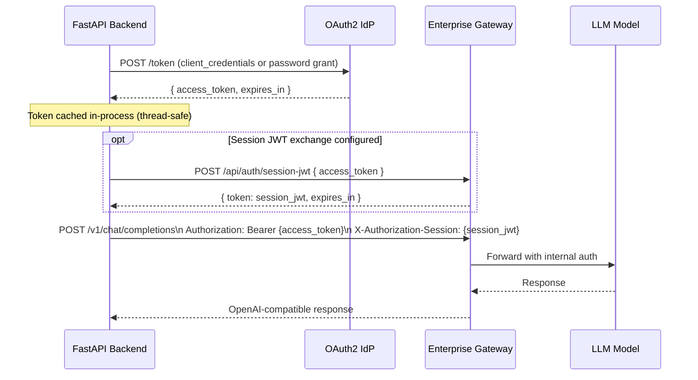

**Token Lifecycle:**
- Tokens cached per-process with TTL from `expires_in` minus 60 seconds safety margin.
- On HTTP 401: invalidate cache, fetch fresh token, retry once.
- Thread-safe: single-flight fetch prevents duplicate token requests under concurrency.

### Credential Vault

UI-submitted credentials are stored in an encrypted on-disk vault (`services/credential_vault.py`). On startup, `ConfigBridge.sync_all()` reads the vault and pushes credentials to cmbagent's `ProviderRegistry`.

**Vault priority:** Vault credentials override `.env` credentials if both are present for the same provider.

### CORS Configuration

```python
# core/config.py — default CORS origins (development)
cors_origins = ["http://localhost:3000", "http://127.0.0.1:3000",
                "http://localhost:3001", "http://127.0.0.1:3001"]

# Production override via .env
NEWSLETTER_CORS_ORIGINS=https://newsletter.mycompany.com
```

### Security Considerations

- No session tokens, JWTs, or cookies issued to the browser.
- API is rate-limited only by LLM provider quotas, not internally.
- For production, deploy behind nginx/Traefik with TLS termination and optionally an API gateway for rate limiting and access control.

---

## 9. Infrastructure

### Current Deployment Model

MARS-NewsLetter is a **local-first** application with no cloud-native dependencies beyond LLM provider APIs. It runs as two processes:

1. **Backend** — Python 3.12 + uvicorn on port 8000
2. **Frontend** — Next.js on port 3000/3001

### Storage Requirements

| Path | Contents | Growth Rate |
|------|----------|------------|
| `<work_dir>/` | Stage artifacts (Markdown, JSON, PDF) | ~1 MB/task |
| `<work_dir>/cmbagent_database.db` | SQLite task/stage state | ~10 KB/task |
| `<work_dir>/logs/` | Structured JSON backend logs | ~500 KB/day |

### Docker Deployment

#### Backend Dockerfile

```dockerfile
FROM python:3.12-slim

WORKDIR /app

# Install system dependencies for WeasyPrint PDF rendering
RUN apt-get update && apt-get install -y \
    libpango-1.0-0 libpangoft2-1.0-0 libgdk-pixbuf2.0-0 \
    libcairo2 libffi-dev libxml2 \
    && rm -rf /var/lib/apt/lists/*

COPY requirements.txt .
RUN pip install --no-cache-dir -r requirements.txt

COPY . .

ENV HOST=0.0.0.0
ENV PORT=8000

CMD ["python", "run.py"]
```

#### Frontend Dockerfile

```dockerfile
FROM node:18-alpine AS builder
WORKDIR /app
COPY package*.json .
RUN npm ci
COPY . .
RUN npm run build

FROM node:18-alpine AS runner
WORKDIR /app
ENV NODE_ENV=production
COPY --from=builder /app/.next/standalone ./
COPY --from=builder /app/.next/static ./.next/static
EXPOSE 3000
CMD ["node", "server.js"]
```

#### docker-compose.yml

```yaml
version: '3.8'

services:
  backend:
    build:
      context: ./backend
      dockerfile: Dockerfile
    ports:
      - "8000:8000"
    environment:
      NEWSLETTER_DEFAULT_WORK_DIR: /data/workdir
      LOG_LEVEL: INFO
      LOG_JSON: "true"
    env_file:
      - ./backend/.env
    volumes:
      - newsletter-data:/data/workdir
    restart: unless-stopped
    healthcheck:
      test: ["CMD", "curl", "-f", "http://localhost:8000/health"]
      interval: 30s
      timeout: 10s
      retries: 3

  frontend:
    build:
      context: ./frontend
      dockerfile: Dockerfile
    ports:
      - "3000:3000"
    environment:
      NEXT_PUBLIC_API_URL: http://backend:8000
      NEXT_PUBLIC_WS_URL: ws://backend:8000
    depends_on:
      backend:
        condition: service_healthy
    restart: unless-stopped

volumes:
  newsletter-data:
    driver: local
```

### Infrastructure Diagram

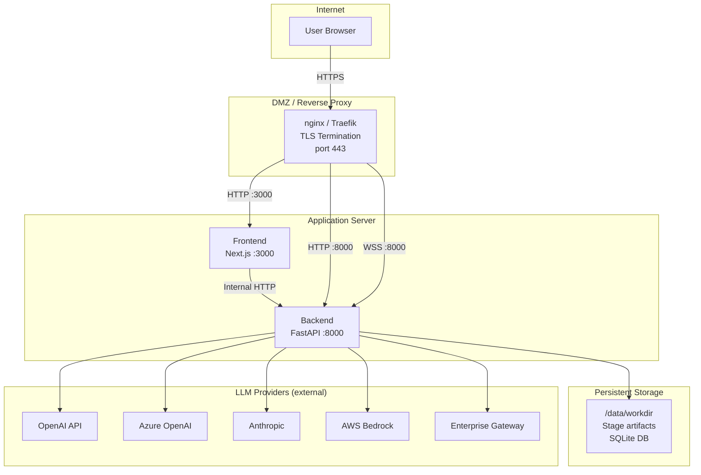

### nginx Configuration (Production)

```nginx
upstream backend {
    server 127.0.0.1:8000;
    keepalive 32;
}

upstream frontend {
    server 127.0.0.1:3000;
}

server {
    listen 443 ssl http2;
    server_name newsletter.mycompany.com;

    ssl_certificate     /etc/ssl/certs/newsletter.crt;
    ssl_certificate_key /etc/ssl/private/newsletter.key;
    ssl_protocols       TLSv1.2 TLSv1.3;
    ssl_ciphers         HIGH:!aNULL:!MD5;

    # Frontend
    location / {
        proxy_pass http://frontend;
        proxy_set_header Host $host;
        proxy_set_header X-Forwarded-For $proxy_add_x_forwarded_for;
        proxy_set_header X-Forwarded-Proto $scheme;
    }

    # Backend API (long timeout for AI stages)
    location /api/ {
        proxy_pass http://backend;
        proxy_read_timeout  600s;
        proxy_send_timeout  600s;
        proxy_set_header Host $host;
        proxy_set_header X-Forwarded-For $proxy_add_x_forwarded_for;
    }

    # WebSocket
    location /ws/ {
        proxy_pass http://backend;
        proxy_http_version 1.1;
        proxy_set_header Upgrade    $http_upgrade;
        proxy_set_header Connection "Upgrade";
        proxy_read_timeout 3600s;
    }
}

server {
    listen 80;
    server_name newsletter.mycompany.com;
    return 301 https://$host$request_uri;
}
```

---

## 10. Configuration

### 10.1 Backend Environment Variables

**Server**

| Variable | Default | Description |
|----------|---------|-------------|
| `HOST` | `0.0.0.0` | uvicorn bind address |
| `PORT` | `8000` | uvicorn listen port |
| `NEWSLETTER_APP_TITLE` | `MARS-NewsLetter API` | OpenAPI title |
| `NEWSLETTER_APP_VERSION` | `0.1.0` | OpenAPI version |
| `NEWSLETTER_DEBUG` | `false` | Enable FastAPI debug mode |
| `NEWSLETTER_ENABLE_RELOAD` | `false` | uvicorn auto-reload (dev only) |
| `NEWSLETTER_CORS_ORIGINS` | `http://localhost:3000,...` | Comma-separated allowed origins |
| `NEWSLETTER_DEFAULT_WORK_DIR` | `./cmbdir_newsletter` | Stage output root (relative to `backend/`) |
| `NEWSLETTER_MAX_FILE_SIZE_MB` | `10` | Max file size for artifact downloads |

**Logging**

| Variable | Default | Description |
|----------|---------|-------------|
| `LOG_LEVEL` | `INFO` | `DEBUG` \| `INFO` \| `WARNING` \| `ERROR` |
| `LOG_JSON` | `false` | `true` for structured JSON (log aggregation) |
| `LOG_FILE` | `""` | Override log path; blank = `<work_dir>/logs/newsletter-backend.log` |

**LLM Provider Selection**

| Variable | Description |
|----------|-------------|
| `CMBAGENT_LLM_PROVIDER` | Explicit provider: `openai` \| `anthropic` \| `azure` \| `aws_bedrock` \| `google` \| `mistral` \| `enterprise_gateway` |
| `OPENAI_API_KEY` | OpenAI API key |
| `ANTHROPIC_API_KEY` | Anthropic API key |
| `AZURE_OPENAI_API_KEY` | Azure OpenAI key |
| `AZURE_OPENAI_ENDPOINT` | Azure endpoint URL |
| `AZURE_OPENAI_DEPLOYMENT` | Deployment name |
| `AZURE_OPENAI_API_VERSION` | API version (default: `2024-12-01-preview`) |
| `AZURE_OPENAI_VERIFY_SSL` | `true` (never disable in production) |
| `AWS_ACCESS_KEY_ID` | AWS static credential (or use IAM role) |
| `AWS_SECRET_ACCESS_KEY` | AWS static credential |
| `AWS_SESSION_TOKEN` | AWS session token (temporary credentials) |
| `AWS_DEFAULT_REGION` | AWS region (default: `us-east-1`) |
| `AWS_PROFILE` | AWS profile name (alternative to static creds) |
| `GOOGLE_API_KEY` | Google Gemini API key |
| `MISTRAL_API_KEY` | Mistral API key |

**Model Configuration**

| Variable | Default | Description |
|----------|---------|-------------|
| `CMBAGENT_DEFAULT_MODEL` | provider default | Global model for all pipeline roles |
| `CMBAGENT_PLANNER_MODEL` | inherited | Planner role model |
| `CMBAGENT_PLAN_REVIEWER_MODEL` | inherited | Plan reviewer model |
| `CMBAGENT_RESEARCHER_MODEL` | inherited | Researcher role model |
| `CMBAGENT_ORCHESTRATION_MODEL` | inherited | Orchestration model |
| `CMBAGENT_FORMATTER_MODEL` | inherited | Formatter role model |

**Pipeline Tuning**

| Variable | Default | Description |
|----------|---------|-------------|
| `STAGE4_SECTION_MODE` | `1` | `1` = section-by-section; `0` = legacy single call |
| `CMBAGENT_MAX_MSG_CONTENT_CHARS` | `200000` | Per-message content cap (raised from cmbagent's 25 KB default) |
| `STAGE5_EDITOR_MAX_TOKENS` | `32000` | Stage 5 editor max output tokens |
| `NEWSLETTER_AI_STAGE_TIMEOUT_S` | `2000` | Hard timeout for any AI stage (seconds) |
| `NEWSLETTER_DEFAULT_MODE` | `one_shot` | Fallback cmbagent mode for all AI stages |
| `NEWSLETTER_STAGE_2_MODE` | inherited | Stage 2 mode override |
| `NEWSLETTER_STAGE_3_MODE` | inherited | Stage 3 mode override |
| `NEWSLETTER_STAGE_4_MODE` | inherited | Stage 4 mode override |
| `NEWSLETTER_STAGE_5_MODE` | inherited | Stage 5 mode override |
| `NEWSLETTER_DEFAULT_MODEL` | inherited | Pipeline-wide model pin |
| `NEWSLETTER_STAGE_2_TOP_COMPANIES` | `12` | Number of companies to discover |
| `NEWSLETTER_STAGE_2_MIN_SOURCES` | `30` | Minimum sources Stage 2 must collect |
| `NEWSLETTER_STAGE_2_ENRICH` | `true` | LLM-enrich user links in user_links_only mode |
| `NEWSLETTER_STAGE5_ENHANCE` | `false` | Per-section LLM polish in Stage 5 (adds cost) |

**Enterprise Gateway**

| Variable | Description |
|----------|-------------|
| `CMBAGENT_ENTERPRISE_GATEWAY_ENABLED` | `true` to activate |
| `ENTERPRISE_LLM_TOKEN_URL` | OAuth2 token endpoint |
| `ENTERPRISE_LLM_GRANT_TYPE` | `password` \| `client_credentials` |
| `ENTERPRISE_LLM_USERNAME` | Service account username (password grant) |
| `ENTERPRISE_LLM_PASSWORD` | Password or client secret |
| `ENTERPRISE_LLM_CLIENT_ID` | OAuth2 client ID |
| `ENTERPRISE_LLM_RESOURCE` | ADFS resource URL (resource-owner grant only) |
| `ENTERPRISE_LLM_SESSION_URL` | Optional session-JWT exchange endpoint |
| `ENTERPRISE_LLM_SESSION_BODY` | Request body template for session JWT |
| `ENTERPRISE_LLM_GATEWAY_BASE_URL` | OpenAI-compatible gateway base URL |
| `ENTERPRISE_LLM_DEFAULT_MODEL` | Default model identifier on gateway |
| `ENTERPRISE_LLM_MODEL_MAP_JSON` | JSON map of canonical → gateway model names |
| `ENTERPRISE_LLM_CA_BUNDLE` | Path to corporate CA certificate bundle |
| `ENTERPRISE_LLM_VERIFY_SSL` | `true` (never `false` in production) |
| `ENTERPRISE_LLM_PROXIES_JSON` | HTTP proxy configuration JSON |
| `ENTERPRISE_LLM_CONSUMER_APPLICATION` | Consumer application identifier |

### 10.2 Frontend Environment Variables

**File:** `frontend/.env.local`

| Variable | Default | Description |
|----------|---------|-------------|
| `NEXT_PUBLIC_API_URL` | `http://localhost:8000` | Backend API base URL |
| `NEXT_PUBLIC_WS_URL` | derived from API_URL | WebSocket base URL |
| `NEXT_PUBLIC_CMBAGENT_WORK_DIR` | `./cmbdir` | Informational only |
| `NEXT_PUBLIC_DEBUG` | `false` | Enable frontend debug mode |

### 10.3 Configuration File Precedence

```
Priority (highest → lowest):

1. CredentialVault (UI-submitted, encrypted on disk)
2. backend/.env.local  (developer override, not committed)
3. backend/.env        (primary config, committed as .env.example)
4. os.environ          (shell environment)
5. Default values in Settings dataclass
```

---

## 11. Application Flow

### 11.1 Newsletter Creation Flow

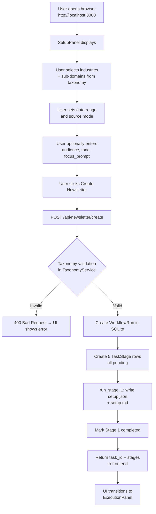

### 11.2 Stage Execution Flow

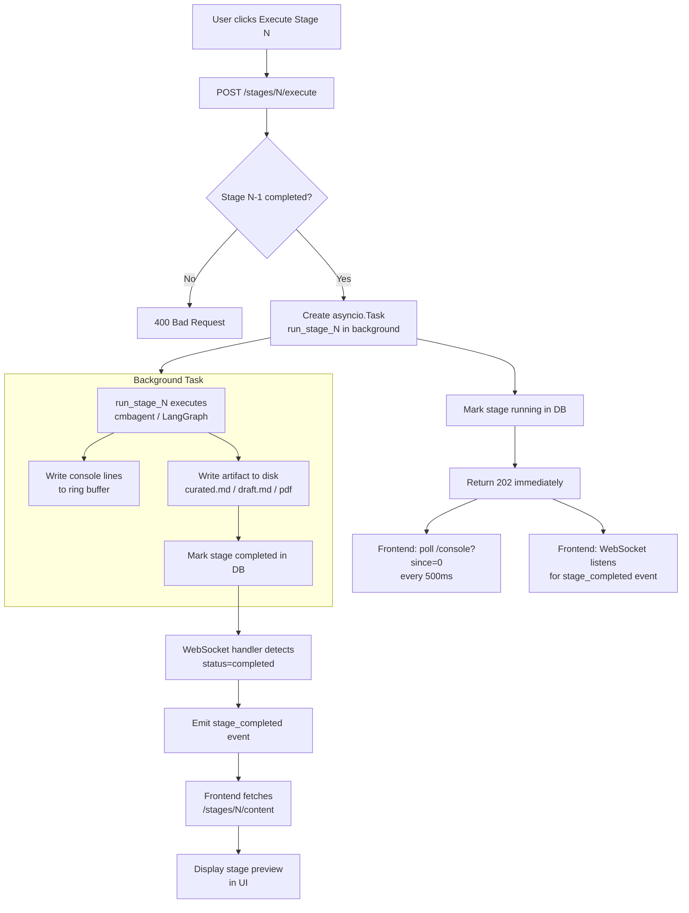

### 11.3 Stage 4 Section Writing Flow

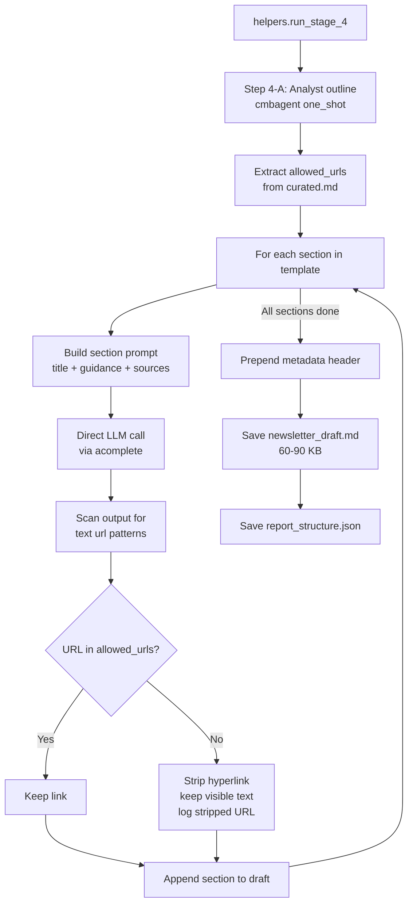

### 11.4 Stage 5 LangGraph Review Flow

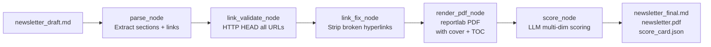

### 11.5 WebSocket Watchdog Flow

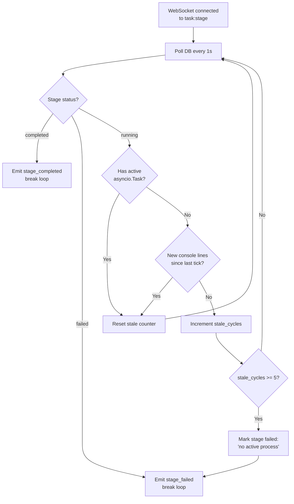

---

## 12. Error Handling

### 12.1 Exception Hierarchy

| Layer | Strategy |
|-------|----------|
| FastAPI route handlers | Pydantic `ValidationError` → 422; explicit `HTTPException` for business errors (400, 404, 409) |
| Stage runners (`helpers.py`) | Try/except around entire stage; on failure: mark `TaskStage.status = "failed"`, write `error_message`, re-raise to background task |
| cmbagent calls | `antirefusal.py` detects LLM refusal text; retries with rescue prompt; gives up after N attempts |
| Link validation | Per-URL try/except; connection errors → `status = "error"`; never raises to caller |
| LangGraph nodes | Each node wrapped in try/except; node failure propagates to graph error state |
| WebSocket handler | Disconnect/close exceptions silently discarded; other exceptions logged at WARNING |

### 12.2 Stage Failure Handling

```python
# In routers/newsletter.py background task wrapper:
try:
    await run_stage_N(setup, work_dir)
    stage.status = "completed"
    stage.completed_at = datetime.now(timezone.utc)
except Exception as exc:
    stage.status = "failed"
    stage.error_message = str(exc)
    stage.completed_at = datetime.now(timezone.utc)
    logger.error("stage_failed", stage=N, error=str(exc))
finally:
    db.commit()
    del _running[buf_key]
```

### 12.3 Refusal Detection (`antirefusal.py`)

Some LLMs refuse to answer certain queries (e.g., "I cannot provide information about..."). The `antirefusal.py` module:
1. Scans the LLM response for known refusal patterns.
2. If detected: rewrites the prompt with a rescue framing and retries.
3. After max retries: raises `RefusalError` which propagates to stage failure.

### 12.4 LLM Timeout

`NEWSLETTER_AI_STAGE_TIMEOUT_S=2000` (configurable) sets a hard wall-clock timeout for any single AI stage. If the stage doesn't complete within this window:
- The background asyncio task is cancelled.
- Stage is marked `failed` with "Execution timeout" error.
- User can retry the stage from the UI.

### 12.5 Retry Logic

| Operation | Retry Strategy |
|-----------|---------------|
| Enterprise gateway token fetch | 1 retry on HTTP 401 (invalidate cache first) |
| HTTP HEAD link validation | 1 retry with 500ms delay on connection error |
| LLM refusal | Up to 3 retries with rescue prompt |
| uvicorn server | Restart handled by Docker/systemd `restart: unless-stopped` |

---

## 13. Performance & Scalability

### 13.1 Performance Characteristics

| Stage | Bottleneck | Typical Duration |
|-------|-----------|-----------------|
| Stage 1 (Setup) | None (deterministic) | < 2 seconds |
| Stage 2 (Source Collection) | DDGS rate limits + LLM calls | 2–8 minutes |
| Stage 3 (Curation) | Single LLM call (ranking) | 3–6 minutes |
| Stage 4 (Generation) | 22 sequential LLM calls (one per section) | 10–25 minutes |
| Stage 5 (Review) | Link HEAD checks + LLM scoring | 5–15 minutes |

**End-to-end for a single newsletter:** ~20–56 minutes  
**LLM cost per run:** typically $1–8 USD depending on provider and model

### 13.2 Async I/O Model

All stage execution is non-blocking from the API's perspective:
- Stages run as `asyncio.Task` objects launched from route handlers.
- Console polling (`/console?since=N`) is a lightweight DB + ring-buffer read.
- WebSocket polling is a 1-second `asyncio.sleep` loop — effectively zero CPU.
- Multiple newsletters can be created and staged simultaneously (limited by LLM provider quota).

### 13.3 Caching

| Component | Cache Location | Invalidation |
|-----------|---------------|-------------|
| Enterprise gateway OAuth2 tokens | In-process dict (thread-safe) | TTL expiry or HTTP 401 |
| Industry taxonomy | In-memory at startup | Server restart |
| Stage artifacts (Markdown/PDF) | On-disk files | Stage re-execution or task deletion |
| Console ring buffer | In-memory (`execution/console_capture.py`) | Process restart |

### 13.4 Concurrency Model

MARS-NewsLetter uses **uvicorn's single-process asyncio model** (default). Under this model:
- Multiple requests are handled concurrently by the event loop.
- Stage background tasks run concurrently (different task IDs).
- Stages within the same task run sequentially (stage N must complete before N+1).
- The `_running` dict is protected by `asyncio.Lock` (not `threading.Lock`) since all access is within the async event loop.

**Scaling horizontally:** Each uvicorn worker has its own `_running` dict and token cache — no shared mutable state means workers scale independently. The SQLite database is the shared state; for production scale, replace with PostgreSQL.

### 13.5 Long-Stage Optimization

Stage 4's original design passed all 80–150 KB of curated data plus all 22 section names to a single cmbagent call. This caused 3+ hour runs. The fix:
- **Analyst outline:** Receives only top 6000 chars of curated data, not the full set.
- **Section writer:** One LLM call per section, each receiving only its relevant subset of sources.
- **Long sections (>700 words):** Chunk approach — outline LLM call → N sub-topic calls → merge.

---

## 14. Security Review

### 14.1 Authentication Gaps

| Risk | Level | Mitigation |
|------|-------|-----------|
| No per-user authentication | Medium | Deploy behind corporate SSO proxy (nginx auth_request or Traefik ForwardAuth) |
| API is open on LAN | Medium | Restrict with firewall rules; use CORS to block browser cross-origin access |
| WebSocket endpoint unauthenticated | Medium | Same proxy-level mitigation as API |

### 14.2 Input Validation

| Input | Validation |
|-------|-----------|
| Industry/sub-domain | Checked against static taxonomy via `TaxonomyService` |
| URLs (user_urls, pinned_urls) | Must start with `http://` or `https://`; checked by Pydantic validator |
| Dates | ISO 8601 format; `date_from` cannot be in the future |
| Stage number | Integer 1–5; prior stage must be completed |
| Content (user edits) | Passed as-is; sanitized at rendering (dompurify on frontend) |
| Provider credentials (UI) | Type-checked by Pydantic; never logged |

### 14.3 Credential Protection

- LLM API keys never sent to the browser.
- API keys masked in all structured log output.
- Credential vault encrypts secrets at rest.
- Enterprise gateway OAuth2 tokens held only in process memory; never written to disk or logs.
- `.env` file is in `.gitignore`; only `.env.example` is committed.

### 14.4 XSS Prevention

The frontend renders user-controlled content (newsletter Markdown) in the browser. `dompurify` is applied before `innerHTML` assignment in `MarkdownRenderer.tsx`. This prevents script injection even if a curated source contained malicious HTML.

### 14.5 SSRF (Server-Side Request Forgery)

The link validator performs HTTP HEAD requests against user-supplied URLs. Mitigations:
- `tldextract` used for domain extraction — prevents IP/port manipulation.
- Only `http://` and `https://` schemes accepted (validated by Pydantic).
- Redirects followed but final URL recorded (enables detection of redirect-based SSRF).

**Remaining gap:** There is no explicit block on RFC1918 addresses (10.x, 192.168.x, 172.16.x). An operator on a flat network could use MARS-NewsLetter to probe internal services. For production: add a pre-check that rejects private-range IPs before the HEAD request.

### 14.6 Dependency Security

Key dependencies with active CVE history:

| Package | Risk Category | Mitigation |
|---------|--------------|-----------|
| `weasyprint` | HTML→PDF (potential XXE) | Only rendering trusted markdown, not user HTML |
| `beautifulsoup4` | HTML parsing | No `lxml` backend used; html.parser only |
| `requests` / `httpx` | HTTP client | Up-to-date versions pinned in requirements.txt |

Recommend running `pip-audit` or `safety check` in CI to catch new CVEs against pinned versions.

### 14.7 Production Security Checklist

```
✅ NEWSLETTER_CORS_ORIGINS set to exact frontend domain (not *)
✅ NEWSLETTER_DEBUG=false
✅ NEWSLETTER_ENABLE_RELOAD=false
✅ LOG_LEVEL=WARNING (not DEBUG — prevents credential leakage in logs)
✅ TLS terminated at reverse proxy (nginx/Traefik)
✅ HTTP → HTTPS redirect enforced
✅ ENTERPRISE_LLM_VERIFY_SSL=true (never false)
✅ .env not committed to version control
✅ Work directory on persistent volume (survives container restart)
✅ Reverse proxy proxy_read_timeout ≥ 600s (AI stages take minutes)
✅ Firewall rules restrict port 8000 to localhost / reverse proxy only
⚠️  No RFC1918 SSRF block on link validator (see Section 14.5)
⚠️  No per-user authentication (deploy behind SSO proxy)
⚠️  No internal rate limiting (LLM quota is the only limit)
```

---

## 15. Developer Guide

### 15.1 Prerequisites

| Tool | Version |
|------|---------|
| Python | 3.12+ |
| Node.js | 18+ |
| npm | 9+ |
| `mars_cmbagent` | 2.2.2+ |
| One LLM provider credential | Any supported provider |

### 15.2 Local Setup

#### Backend

```bash
# 1. Clone repository
git clone <repo-url> MARS_NewsLetter
cd MARS_NewsLetter/backend

# 2. Create virtual environment
python3.12 -m venv venv
source venv/bin/activate       # Windows: venv\Scripts\activate

# 3. Install dependencies
pip install -r requirements.txt

# 4. Configure environment
cp .env.example .env
$EDITOR .env                   # Set at least one LLM provider

# 5. Start backend
python run.py
# Backend available at http://localhost:8000
# Swagger UI at http://localhost:8000/docs
```

#### Frontend

```bash
cd MARS_NewsLetter/frontend

# 1. Install Node dependencies
npm install

# 2. Configure environment (optional for localhost)
cp .env.local.example .env.local

# 3. Start development server
npm run dev
# Frontend available at http://localhost:3001
```

#### Using a Local mars_cmbagent Checkout

```bash
# If developing against a local cmbagent checkout:
pip install -e /path/to/mars_cmbagent[enterprise_gateway]
# This takes precedence over the PyPI version in requirements.txt
```

### 15.3 Project Scripts

**Backend**

| Command | Description |
|---------|-------------|
| `python run.py` | Start uvicorn server (loads .env) |
| `python -m pytest tests/` | Run unit tests |
| `python tests/e2e_smoke.py` | End-to-end smoke test |

**Frontend**

| Command | Description |
|---------|-------------|
| `npm run dev` | Start Next.js dev server (port 3001) |
| `npm run build` | Production build |
| `npm start` | Start production server (port 3000) |
| `npm run lint` | ESLint |
| `npm run type-check` | TypeScript type check |

### 15.4 Adding a New Industry to the Taxonomy

1. Edit `backend/data/industry_taxonomy.json`.
2. Add entry under `industries` array:
   ```json
   {
     "industry": "New Industry Name",
     "industry_domain": "new_industry",
     "sub_domains": ["Sub-domain 1", "Sub-domain 2"]
   }
   ```
3. Optionally add authority domain hints to `authentic_domain_hints`.
4. Restart the backend (taxonomy loaded at startup).

### 15.5 Adding a Custom Search Tool

See `docs/CUSTOM_TOOLS.md`. Short form:

```python
# In a module loaded at startup (e.g., backend/tools/brave_search.py)
from cmbagent.external_tools import register_tool

@register_tool(name="brave_search", description="Search the web via Brave Search API", category="premium_search")
def brave_search(query: str) -> str:
    import requests
    resp = requests.get(
        "https://api.search.brave.com/res/v1/web/search",
        params={"q": query},
        headers={"Accept": "application/json", "X-Subscription-Token": BRAVE_API_KEY},
        timeout=20,
    )
    return resp.json()["web"]["results"][0]["description"]  # format as needed
```

Import this module in `main.py` before the app is created to ensure registration.

### 15.6 Debugging

**Enable verbose logging:**
```bash
LOG_LEVEL=DEBUG python run.py
```

**Inspect stage artifacts:**
```bash
ls <work_dir>/sessions/newsletter/tasks/<task_id>/
cat <work_dir>/sessions/newsletter/tasks/<task_id>/stage_4/newsletter_draft.md
```

**Query the SQLite database:**
```bash
sqlite3 <work_dir>/cmbagent_database.db
.tables
SELECT id, status, error_message FROM task_stages WHERE parent_run_id = '<task_id>';
```

**Watch live console output:**
```bash
tail -f <work_dir>/sessions/newsletter/tasks/<task_id>/stage_N/console.log
```

**Re-run Stage 5 (PDF only, no LLM):**
```bash
curl -X POST http://localhost:8000/api/newsletter/<task_id>/regenerate-pdf
```

---

## 16. Deployment Guide

### 16.1 Build

```bash
# Backend — no build step required; Python runs directly
pip install -r requirements.txt

# Frontend — production build
cd frontend
npm ci
npm run build
```

### 16.2 Package (Docker)

```bash
# Build backend image
docker build -t mars-newsletter-backend:latest ./backend

# Build frontend image
docker build -t mars-newsletter-frontend:latest ./frontend

# Or build both with compose
docker-compose build
```

### 16.3 Deploy

```bash
# Using docker-compose
docker-compose up -d

# Verify services
docker-compose ps
curl http://localhost:8000/health
curl http://localhost:3000
```

### 16.4 Deploy with Systemd (non-Docker)

**Backend service file** (`/etc/systemd/system/mars-newsletter-backend.service`):
```ini
[Unit]
Description=MARS-NewsLetter Backend
After=network.target

[Service]
Type=simple
User=newsletter
WorkingDirectory=/opt/mars-newsletter/backend
ExecStart=/opt/mars-newsletter/backend/venv/bin/python run.py
Restart=on-failure
RestartSec=5
EnvironmentFile=/opt/mars-newsletter/backend/.env

[Install]
WantedBy=multi-user.target
```

```bash
sudo systemctl daemon-reload
sudo systemctl enable mars-newsletter-backend
sudo systemctl start mars-newsletter-backend
```

### 16.5 Zero-Downtime Update

```bash
# Pull new code
git pull origin main

# Backend
pip install -r requirements.txt   # install any new deps
sudo systemctl restart mars-newsletter-backend

# Frontend
npm ci
npm run build
sudo systemctl restart mars-newsletter-frontend  # or PM2 restart
```

### 16.6 Rollback

```bash
# Identify last working commit
git log --oneline -10

# Rollback to specific commit
git checkout <commit-hash>
pip install -r requirements.txt
sudo systemctl restart mars-newsletter-backend

# Frontend rollback
npm ci && npm run build
sudo systemctl restart mars-newsletter-frontend
```

**Database rollback:** SQLite schema is managed by cmbagent ORM migrations. Rollback by reverting the `mars_cmbagent` pip version and restoring the DB file from backup. On-disk artifacts are append-only; old task directories are unaffected by new deployments.

---

## 17. Operational Runbook

### 17.1 Health Checks

```bash
# Backend health
curl http://localhost:8000/health
# Expected: { "status": "ok" }

# Backend Swagger UI reachable
curl -s http://localhost:8000/docs | grep -c "swagger"

# Frontend reachable
curl -s http://localhost:3000 | grep -c "MARS"

# Database file exists and is readable
sqlite3 <work_dir>/cmbagent_database.db "SELECT count(*) FROM workflow_runs;"
```

### 17.2 Monitoring

**Key metrics to watch:**

| Metric | Source | Alert Threshold |
|--------|--------|-----------------|
| Backend process alive | systemd / Docker health check | Any restart |
| Stage failure rate | DB: `SELECT count(*) FROM task_stages WHERE status='failed'` | > 20% of recent stages |
| Disk usage (work_dir) | `du -sh <work_dir>` | > 80% of available disk |
| LLM API errors | `grep "llm_error" <work_dir>/logs/newsletter-backend.log` | Any 429 (rate limit) or 5xx |
| Stage timeout frequency | `grep "timeout" <work_dir>/logs/newsletter-backend.log` | > 2/day |
| PDF generation failures | `grep "pdf.*error" logs/` | Any |

**Log aggregation query (structured JSON):**
```bash
cat <work_dir>/logs/newsletter-backend.log | jq 'select(.level == "error")'
cat <work_dir>/logs/newsletter-backend.log | jq 'select(.event == "stage_failed")'
```

### 17.3 Common Failures

#### Stage runs for > 30 minutes then hangs

**Cause:** cmbagent entered an infinite planning loop (rare), or LLM provider rate limit causing silent retry loops.

**Diagnosis:**
```bash
# Check for active background task
curl http://localhost:8000/api/newsletter/<task_id>/stages/<N>/console?since=0 | jq '.lines[-5:]'
```

**Fix:**
1. Check LLM provider dashboard for rate limit events.
2. If stuck: mark the stage failed via direct DB update:
   ```sql
   UPDATE task_stages SET status='failed', error_message='manual kill', completed_at=datetime('now')
   WHERE parent_run_id='<task_id>' AND stage_number=<N>;
   ```
3. Increase `NEWSLETTER_AI_STAGE_TIMEOUT_S` if legitimately slow content.
4. Retry the stage from the UI.

#### Stage 2 returns empty results

**Cause:** DuckDuckGo DDGS rate limiting (HTTP 202 with no results) or network connectivity to DDGS.

**Diagnosis:**
```bash
cat <work_dir>/sessions/newsletter/tasks/<task_id>/stage_2/console.log | grep -i "ddgs\|results\|error"
```

**Fix:**
1. Retry Stage 2 — DDGS rate limits are usually transient (< 5 minutes).
2. Switch to `source_mode: user_links_only` with manually supplied URLs.
3. Configure a premium search API (Brave, Serper) to replace DDGS.

#### PDF generation fails in Stage 5

**Cause:** WeasyPrint system library missing (Pango, Cairo), or newsletter draft is malformed.

**Diagnosis:**
```bash
grep "pdf" <work_dir>/sessions/newsletter/tasks/<task_id>/stage_5/console.log
```

**Fix:**
```bash
# Install system dependencies for WeasyPrint
apt-get install -y libpango-1.0-0 libpangoft2-1.0-0 libgdk-pixbuf2.0-0 libcairo2

# Or regenerate using the reportlab fallback
curl -X POST http://localhost:8000/api/newsletter/<task_id>/regenerate-pdf
```

#### LLM authentication failure (Enterprise Gateway)

**Cause:** OAuth2 token expired or credentials rotated.

**Diagnosis:**
```bash
grep "401\|token\|auth" <work_dir>/logs/newsletter-backend.log | tail -20
```

**Fix:**
1. Update `ENTERPRISE_LLM_PASSWORD` / `ENTERPRISE_LLM_CLIENT_ID` in `.env`.
2. Restart backend to reload credentials.
3. If using credential vault: update via the provider settings UI (no restart needed).

#### Stage 3 drops too many sources

**Cause:** Quality filter is too aggressive (date filtering).

**Fix:**
- Check `quality_filter.json` in stage_3 directory to see what was dropped.
- Use Gate A (`POST /gate/links`) to pin important URLs before re-running Stage 3.
- If systematic: lower `min_relevance` threshold in Gate A request.

#### WebSocket disconnects immediately

**Cause:** Reverse proxy timeout on idle WebSocket connection.

**Fix:** Increase `proxy_read_timeout` in nginx to 3600s for `/ws/` locations. The WebSocket sends a 1-second keepalive loop while the stage is running.

### 17.4 Log Reference

**Key structured log events:**

| Event | Level | Meaning |
|-------|-------|---------|
| `stage_started` | INFO | Background task launched |
| `stage_completed` | INFO | Stage finished successfully |
| `stage_failed` | ERROR | Stage threw an exception; `error` field has detail |
| `ws_disconnected` | DEBUG | WebSocket client disconnected normally |
| `ws_error` | WARNING | Unexpected WebSocket error |
| `llm_error` | ERROR | LLM API returned non-200 |
| `token_refresh` | DEBUG | Enterprise gateway token refreshed |
| `link_validation_complete` | INFO | URL health check batch finished |
| `pdf_generated` | INFO | PDF file written successfully |
| `taxonomy_validation_failed` | WARNING | User selected invalid industry/sub-domain |

---

## 18. Known Risks & Technical Debt

### 18.1 Confirmed Issues

| # | Issue | Impact | Status |
|---|-------|--------|--------|
| 1 | No per-user authentication | Any user with network access can create/delete tasks | Open — deploy behind SSO proxy |
| 2 | SQLite is single-writer | Concurrent stage executions across large user groups will serialize on DB writes | Open — replace with PostgreSQL for multi-user production |
| 3 | `_running` task dict is in-process | On uvicorn restart, running tasks are lost; stage stays `running` forever until WebSocket watchdog fires | Mitigated — watchdog marks stale after 5 seconds; user can retry |
| 4 | DDGS (DuckDuckGo Search) rate limiting | Stage 2 can return empty results; no retry budget | Open — add exponential backoff; recommend premium search API |
| 5 | No SSRF protection on RFC1918 IPs | Link validator will probe internal network addresses if user supplies them | Open — add pre-check IP block |
| 6 | WeasyPrint requires system libraries | PDF generation fails silently if Pango/Cairo not installed | Mitigated — reportlab fallback available |
| 7 | Stage 4 model overrides not persisted on retry | If user sets model override at execute time, a retry uses default model | Minor UX issue |
| 8 | On-disk artifacts never auto-pruned | Disk fills up over time | Open — add retention policy (e.g., delete tasks older than 30 days) |
| 9 | Gate B (section template) frontend not fully implemented | Users must call the API directly to set a custom template | Open — GateTemplate.tsx component needs completion |

### 18.2 Technical Debt

| Area | Debt | Recommendation |
|------|------|----------------|
| Testing | Only smoke tests + limited unit tests; no integration tests for individual pipeline stages | Add pytest-asyncio test suite with mocked LLM responses |
| Frontend state | No global error boundary; unhandled promise rejections can leave UI in inconsistent state | Add React Error Boundaries at stage level |
| Database | SQLite with SQLAlchemy ORM; no connection pooling | Migrate to PostgreSQL + asyncpg for production |
| Config | No config validation at startup; bad env vars discovered only when they cause errors | Add `Settings.validate()` call in lifespan that checks required vars before accepting traffic |
| API versioning | No API version in URL path | Add `/v1/` prefix now before external consumers exist |
| LLM cost | Cost tracking per stage is best-effort (token counting may differ by model) | Add litellm's native cost tracking + expose via `GET /api/newsletter/{id}/cost` |
| Docker | No official Dockerfile committed; examples in docs only | Add `Dockerfile` + `docker-compose.yml` to repository root |
| CI/CD | No `.github/workflows/` or CI configuration found | Add GitHub Actions: lint, type-check, smoke test on PR |

### 18.3 Scalability Roadmap

For teams generating more than ~50 newsletters/day:

1. **Replace SQLite with PostgreSQL** — removes write serialization bottleneck.
2. **Move stage runners to Celery workers** — decouples pipeline CPU from FastAPI event loop; enables horizontal scaling of workers independently.
3. **Add Redis for ring buffers** — replaces in-process console capture dict; survives worker restarts and enables multi-worker console streaming.
4. **Add S3/Azure Blob for artifacts** — replaces local filesystem; enables distributed workers and indefinite artifact retention.
5. **Add per-user quota enforcement** — rate limit newsletter creations per user/org to protect LLM budget.

---

*End of MARS-NewsLetter Enterprise Documentation*

*Generated by reverse-engineering the codebase at commit HEAD · 2026-07-29*
